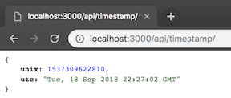
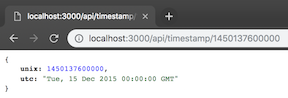
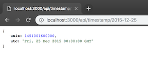

# API Project: Timestamp Microservice for FCC - Completed

## View on [Glitch](https://wiggly-aurora.glitch.me/)

## Endpoints created:

GET /api/timestamp/ => { unix: currentTimeInUnix, utc: currentTimeInUTC }

GET /api/timestamp/2015-12-25 => { unix: 1451001600000, utc: "Fri, 25 Dec 2015 00:00:00 GMT" }

GET /api/timestamp/1450137600 => { unix: 1450137600, utc: "Sat, 17 Jan 1970 18:48:57 GMT" }

  

## To run this project locally

1. Https or SSH download this project.
2. `npm install`
3. navigate to localhost:3000/api/timestamp

## User stories :

1. The API endpoint is `GET [project_url]/api/timestamp/:date_string?`
2. A date string is valid if can be successfully parsed by `new Date(date_string)` (JS) . Note that the unix timestamp needs to be an **integer** (not a string) specifying **milliseconds**. In our test we will use date strings compliant with ISO-8601 (e.g. `"2016-11-20"`) because this will ensure an UTC timestamp.
3. If the date string is **empty** it should be equivalent to trigger `new Date()`, i.e. the service uses the current timestamp.
4. If the date string is **valid** the api returns a JSON having the structure
   `{"unix": <date.getTime()>, "utc" : <date.toUTCString()> }`
   e.g. `{"unix": 1479663089000 ,"utc": "Sun, 20 Nov 2016 17:31:29 GMT"}`.
5. If the date string is **invalid** the api returns a JSON having the structure `{"unix": null, "utc" : "Invalid Date" }`. It is what you get from the date manipulation functions used above.

#### Example usage:

- https://curse-arrow.hyperdev.space/api/timestamp/2015-12-15
- https://curse-arrow.hyperdev.space/api/timestamp/1450137600000

#### Example output:

- { "unix": 1450137600, "natural": "December 15, 2015" }
